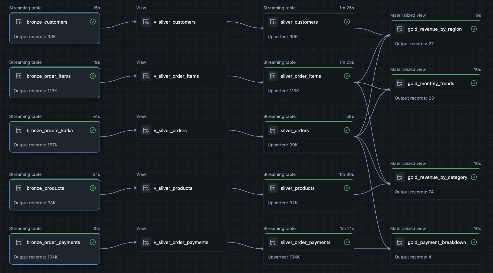
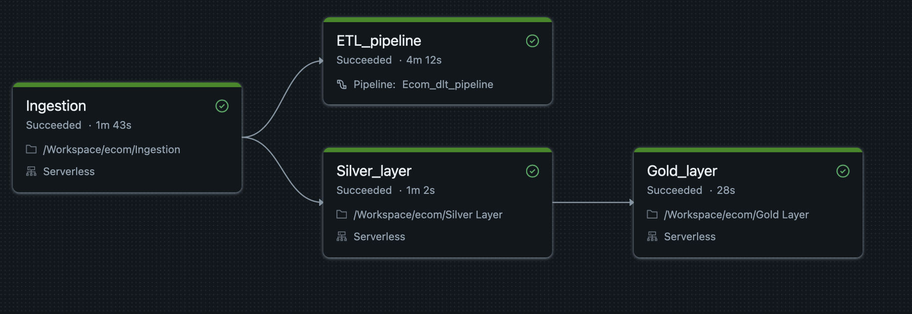

# ecom-databricks
# Ecommerce Lakehouse — Production-Grade Data Pipeline on Databricks

An end-to-end data lakehouse built on Databricks using dual ingestion 
(Confluent Kafka + Databricks Volumes), medallion architecture, Delta 
Live Tables with SCD Type 1, and automated CI/CD via Databricks Asset 
Bundles and GitHub Actions.

---

## Pipeline Architecture



---

## Workflow Orchestration



---

## Tech Stack

| Layer | Technology |
|---|---|
| Streaming Ingestion | Confluent Kafka, Spark Structured Streaming |
| Batch Ingestion | Databricks Volumes, PySpark |
| Storage | Delta Lake |
| Transformation | Delta Live Tables (DLT) |
| Data Quality | DLT Expectations (expect, expect_or_drop, expect_or_fail) |
| Change Data Capture | SCD Type 1 via dlt.apply_changes() |
| Orchestration | Databricks Workflows |
| Deployment | Databricks Asset Bundles (DAB) |
| CI/CD | GitHub Actions |
| Language | Python, PySpark, SQL |

---

## Project Structure
```
ecom-lakehouse/
├── .github/
│   └── workflows/
│       └── deploy.yml        # CI/CD — lint + deploy on push to main
├── src/
│   └── Ecom_dlt_pipeline/
│       └── transformations/
│           ├── bronze.py     # Bronze — Kafka + Volumes ingestion
│           ├── silver.py     # Silver — views + SCD Type 1
│           └── gold.py       # Gold — business aggregations
├── images/
│   ├── dlt_pipeline_graph.png
│   └── workflow_graph.png
├── databricks.yml            # DAB config — infrastructure as code
├── requirements.txt
└── README.md
```

---

## Data Architecture

### Source Data

**Batch:** [Brazilian E-Commerce Dataset by Olist](https://www.kaggle.com/datasets/olistbr/brazilian-ecommerce)
— 100,000+ real orders across 9 tables, ingested via Databricks Volumes

**Streaming:** Confluent Kafka topic `Ecom_orders` — synthetic order 
events generated via Confluent Datagen connector with custom OlistOrder 
schema matching batch data structure exactly

---

### Dual Ingestion Design

Both ingestion paths feed the same Silver layer:
```
Confluent Kafka (real-time)       Databricks Volumes (Streaming)
        ↓                                     ↓
bronze_orders_kafka               bronze_orders(batch), bronze_customers,
(Structured Streaming)            bronze_products, bronze_order_items,
        ↓                         bronze_order_payments
        └──────────┬──────────────────────────┘
                   ↓
          v_silver_orders (DLT View)
          DLT Expectations + Transformations
                   ↓
          silver_orders (SCD Type 1)
          dlt.create_auto_cdc_flow()
```

---

### Medallion Architecture

**Bronze — Raw Ingestion**
- Kafka: `spark.readStream` with SASL_SSL auth, `startingOffsets=earliest`
- Volumes: append_flow with `once=True` for CSV batch data
- Both sources append to `bronze_orders_kafka` via `append_flow`
- No transformations — immutable source of truth
- Metadata: `_ingestion_time`, `_kafka_offset`, `_kafka_timestamp`

**Silver — Transformation + Quality**
- DLT Views apply type casting, cleaning, and expectations
- Three quality tiers:
  - `@dlt.expect` — warn, keep record
  - `@dlt.expect_or_drop` — silently drop bad records
  - `@dlt.expect_or_fail` — fail pipeline on critical violations
- SCD Type 1 via `dlt.apply_changes()` — latest record always wins
- `_quality_flag` column for downstream monitoring

**Gold — Aggregations**
- Revenue by product category (74 categories)
- Revenue by customer region (27 Brazilian states)
- Monthly order trends (23 months)
- Payment method breakdown (4 payment types)

---

## Data Quality Rules

| Table | Rule | Action |
|---|---|---|
| silver_orders | order_id IS NOT NULL | Drop |
| silver_orders | customer_id IS NOT NULL | Drop |
| silver_orders | order_purchase_timestamp IS NOT NULL | Fail pipeline |
| silver_orders | valid order_status values | Warn |
| silver_orders_streaming | order_id IS NOT NULL | Drop |
| silver_orders_streaming | customer_id IS NOT NULL | Drop |
| silver_order_payments | valid payment_type | Warn |
| silver_customers | customer_id IS NOT NULL | Drop |

---

## Workflow Orchestration

**Task execution (parallel DAG):**
```
[Ingestion] — 38s
      ↓
┌─────────────────────┐
↓                     ↓
[ETL_pipeline] 4m12s  [Silver_layer] 43s
                             ↓
                       [Gold_layer] 23s
```

- Ingestion runs first — loads Bronze from Volumes
- ETL_pipeline (DLT) and Silver_layer run in parallel
- Gold_layer runs after Silver completes
- Email alerting on success and failure

---

## CI/CD Pipeline

Every push to `main` triggers GitHub Actions:

1. **Lint** — flake8 across all notebooks and DLT files
2. **Deploy** — `databricks bundle deploy` via DAB on clean lint

Credentials stored as GitHub Secrets — never in code.
Kafka credentials stored in Databricks Secret Scope — never in notebooks.

---

## Key Design Decisions

**Why dual ingestion (Kafka + Volumes)?**
Demonstrates both streaming and batch patterns on the same 
pipeline. Kafka handles real-time order events; Volumes handles 
historical batch data. Both feed the same Silver layer via 
append_flow — downstream tables are source-agnostic.

**Why append_flow with once=True for CSV?**
Treats batch CSV data as a bounded stream — processes it once 
and stops, while Kafka continues streaming. This unified approach 
means Silver SCD logic handles both sources identically without 
separate pipelines.

**Why DLT Views before Silver tables?**
Views apply transformations and expectations without materialising 
intermediate data. Only validated records reach Silver tables via 
SCD Type 1 merge — storage efficient and clean.

**Why SCD Type 1 in Silver?**
Order status updates arrive from both Kafka and batch. SCD Type 1 
ensures Silver always reflects the latest state — if the same 
order_id arrives from both sources, the latest version by 
order_purchase_timestamp wins automatically.

**Why parallel Workflow execution?**
ETL_pipeline (DLT) and Silver_layer notebooks are independent 
after Bronze ingestion. Parallel execution reduces total pipeline 
runtime by ~66 seconds.

**Why DAB over Databricks CLI?**
DAB treats the entire project — notebooks, jobs, DLT pipelines — 
as versioned infrastructure. One command reproduces the full 
environment across dev and prod targets.

**Why Databricks Secrets for Kafka credentials?**
API keys never appear in notebook code or Git history. 
Secrets are scoped to the workspace and referenced at runtime 
only — production security standard.

---

## Row Counts

| Table | Records | Source |
|---|---|---|
| bronze_orders_kafka | 107,000+ | Kafka + CSV via append_flow |
| silver_customers | 99,441 | Stream |
| silver_orders | 99,441 | Stream + Kafka merged |
| silver_order_items | 112,650 | Stream |
| silver_order_payments | 103,886 | Stream |
| gold_revenue_by_category | 74 | Aggregated |
| gold_revenue_by_region | 27 | Aggregated |
| gold_monthly_trends | 23 | Aggregated |
| gold_payment_breakdown | 4 | Aggregated |

---

## How to Run

### Prerequisites
- Databricks workspace
- Databricks CLI v0.200+ installed
- Confluent Cloud account (free tier)
- Python 3.10+

### Setup
```bash
# Clone repo
git clone https://github.com/Ash-delrone/ecom-databricks.git
cd ecom-lakehouse

# Configure Databricks
databricks configure

# Set up Kafka secrets
databricks secrets create-scope kafka-secrets
databricks secrets put-secret kafka-secrets kafka-api-key
databricks secrets put-secret kafka-secrets kafka-api-secret
databricks secrets put-secret kafka-secrets kafka-bootstrap-server

# Deploy and run
databricks bundle deploy --target dev
databricks bundle run ecom_combined_pipeline --target dev
```

---

## Author
**Ashwani Srivastava**  
Data Engineer | Databricks Certified | PwC India  
[LinkedIn](https://linkedin.com/in/ashwani2023) | 
[Email](mailto:srivastava.ashwani448@gmail.com)
