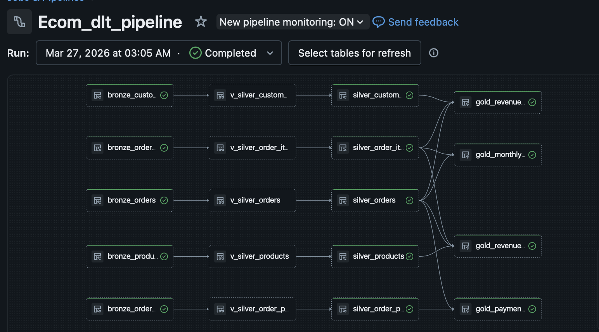
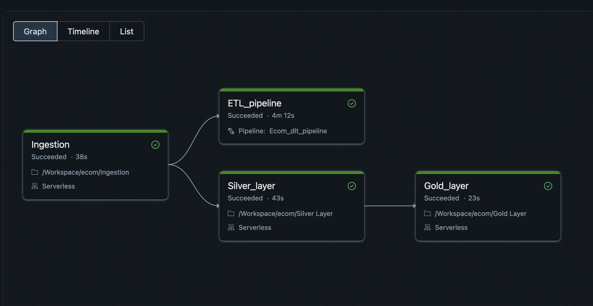

# ecom-databricks
# Ecommerce Lakehouse — Production-Grade Data Pipeline on Databricks

An end-to-end data lakehouse built on Databricks using the medallion 
architecture, Delta Live Tables, SCD Type 1, and automated CI/CD 
via Databricks Asset Bundles and GitHub Actions.

---

## Pipeline Architecture



---

## Tech Stack

| Layer | Technology |
|---|---|
| Storage | Databricks Volumes, Delta Lake |
| Ingestion | PySpark, Apache Spark |
| Transformation | Azure Databricks, Delta Live Tables |
| Data Quality | DLT Expectations (expect, expect_or_drop, expect_or_fail) |
| Change Data Capture | SCD Type 1 via dlt.apply_changes() |
| Orchestration | Databricks Workflows (DAG with parallel execution) |
| Deployment | Databricks Asset Bundles (DAB) |
| CI/CD | GitHub Actions |
| Language | Python, PySpark, SQL |

---

## Project Structure
```
ecom-lakehouse/
├── .github/
│   └── workflows/
│       └── deploy.yml        # CI/CD — lint + deploy on push to main
├── notebooks/
│   ├── 01_ingestion.ipynb       # Bronze — raw CSV ingestion from Volumes
│   ├── 02_silver_layer.ipynb    # Silver — typed, cleaned, deduped
│   └── 03_gold_layer.ipynb      # Gold — business aggregations
├── dlt/
│   └── 04_dlt_pipeline.py    # DLT — full Bronze→Silver→Gold with quality
├── databricks.yml            # DAB config — infrastructure as code
├── requirements.txt
└── README.md
```

---

## Data Architecture

### Source Data
[Brazilian E-Commerce Dataset by Olist](https://www.kaggle.com/datasets/olistbr/brazilian-ecommerce)
— 100,000+ real orders across 9 tables

### Medallion Architecture

**Bronze — Raw Ingestion**
- Reads CSV files from Databricks Volumes
- Append-only writes to Delta tables
- Adds `_ingestion_time` and `_source_file` metadata
- No transformations — immutable source of truth

**Silver — Transformation + Quality**
- DLT Views apply transformations and expectations
- SCD Type 1 via `dlt.apply_changes()` — latest record always wins
- Three quality tiers: warn, drop, fail

**Gold — Aggregations**
- Revenue by product category
- Revenue by customer region (state)
- Monthly order trends
- Payment method breakdown

---

## Data Quality Rules

| Table | Rule | Action |
|---|---|---|
| silver_orders | order_id IS NOT NULL | Drop |
| silver_orders | purchase_timestamp IS NOT NULL | Fail pipeline |
| silver_orders | valid order_status values | Warn |
| silver_order_payments | valid payment_type | Warn |
| silver_customers | customer_id IS NOT NULL | Drop |

---

## Workflow Orchestration



**Task execution:**
- `Ingestion` → runs first (38s)
- `Silver_layer` + `ETL_pipeline` → run in parallel after ingestion
- `Gold_layer` → runs after Silver completes

---

## CI/CD Pipeline

Every push to `main` triggers GitHub Actions:

1. **Lint** — flake8 runs across all notebooks and DLT files
2. **Deploy** — `databricks bundle deploy` via DAB on clean lint

---

## Key Design Decisions

**Why append-only Bronze?**
Bronze is an immutable audit log. If Silver has a bug, 
we reprocess from Bronze without any data loss.

**Why DLT Views before Silver tables?**
Views apply transformations and quality checks without 
materialising intermediate data. Only clean, validated 
records reach Silver tables via SCD Type 1 merge.

**Why SCD Type 1 in Silver?**
Order status updates arrive continuously. SCD Type 1 
ensures Silver always reflects the latest state without 
storing historical versions — appropriate for operational 
reporting.

**Why parallel Workflow execution?**
ETL_pipeline (DLT) and Silver_layer notebooks are 
independent after ingestion. Running them in parallel 
reduces total pipeline time by ~4 minutes.

**Why DAB over Databricks CLI?**
DAB treats the entire project — notebooks, jobs, DLT 
pipelines — as versioned infrastructure. One command 
reproduces the full environment.

---

## Row Counts (Silver Layer)

| Table | Records |
|---|---|
| silver_customers | 99,441 |
| silver_orders | 99,441 |
| silver_order_items | 112,650 |
| silver_order_payments | 103,886 |

---

## How to Run

### Prerequisites
- Databricks workspace
- Databricks CLI v0.200+ installed
- Python 3.10+

### Setup
```bash
git clone https://github.com/Ash-delrone/ecom-databricks.git
cd ecom-lakehouse
databricks configure
databricks bundle deploy --target dev
databricks bundle run ecom_combined_pipeline --target dev
```

---

## Author
**Ashwani Srivastava**  
Data Engineer | Databricks Certified | PwC India  
[LinkedIn](https://linkedin.com/in/ashwani2023) | 
[Email](mailto:srivastava.ashwani448@gmail.com)
